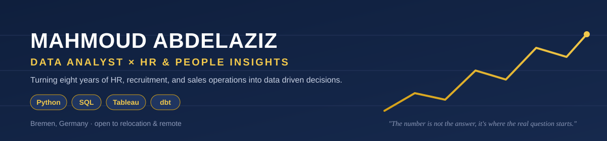
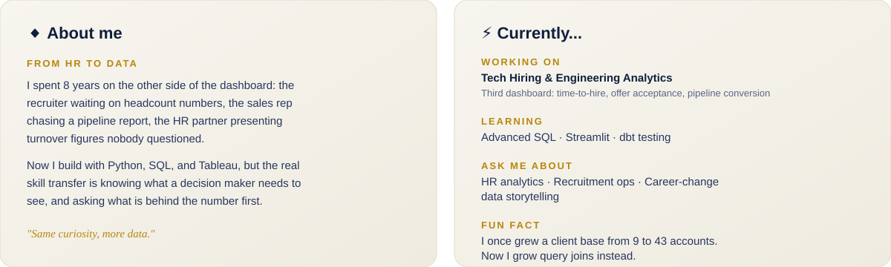

### 🌐 Connect

### Technical Toolkit

            
Tableau &middot; dbt &middot; Statistical Analysis &middot; Machine Learning &middot; Excel

 

### Featured Projects

**Workforce & HR Analytics Dashboard.** End-to-end HR analytics project covering the full pipeline from synthetic data through dbt staging and marts to a published Tableau dashboard, with a Streamlit companion app. [Tableau](https://public.tableau.com/app/profile/mahmoud.abdelaziz2733/viz/WorkforceHRAnalytics/WorkforceOverview) &middot; [Streamlit](https://workforce-analytics-meridiangit-b5pvkjtuuvkafoczkghhhy.streamlit.app/) &middot; [Repo](https://github.com/Simba90m/workforce-analytics-meridian)

**Logistics & Supply Chain Analytics: Atlas Global Logistics.** End-to-end supply chain analytics project for a fictional global logistics company, with a dbt pipeline, a real warehouse map, and a Tableau dashboard with cross-chart filter and highlight actions. [Tableau](https://public.tableau.com/app/profile/mahmoud.abdelaziz2733/viz/AtlasGlobalLogistics/Dashboard1) &middot; [Streamlit](https://dashboardapppy-xrvbqn8vmudetwlephtaap.streamlit.app/) &middot; [Repo](https://github.com/Simba90m/logistics-supply-chain-atlas)

**Data Modeling with dbt.** Staging to marts pipelines across two schemas (shop_smart and northwind), with tests. See the [dbt_project_mahmoud](https://github.com/Simba90m/dbt_project_mahmoud) repo.

**Airports, Flights and Weather Dashboard.** A Tableau dashboard analyzing flight delay and cancellation KPIs across routes and airlines. Published on my [Tableau Public profile](https://public.tableau.com/app/profile/mahmoud.abdelaziz2733/vizzes).

**Netflix Content Dashboard.** An interactive Tableau Public dashboard breaking down a content library by genre, release trend, and rating.

**Muesli Sales Analysis.** Exploratory data analysis on sales data using Python, Pandas, Matplotlib, and Seaborn to surface performance trends.

**Premier League Recruitment Capstone, "Worth the Investment."** In progress. A forecasting model and dashboard identifying which players represent the best value relative to injury risk and expected performance.

More detail on each project is in my resume and portfolio, linked above.

<picture>
  <source media="(prefers-color-scheme: dark)" srcset="https://raw.githubusercontent.com/tobiasmeyhoefer/tobiasmeyhoefer/output/github-snake-dark.svg" />
  <source media="(prefers-color-scheme: light)" srcset="https://raw.githubusercontent.com/tobiasmeyhoefer/tobiasmeyhoefer/output/github-snake.svg" />
  
</picture>

# 📊 GitHub Stats:
 
 

### ✍️ Random Dev Quote

---

### Background

8+ years in HR, recruitment, and B2B sales before transitioning to data analytics. Grew a client base nearly 5x and recruited 400+ employees across those roles.

  

